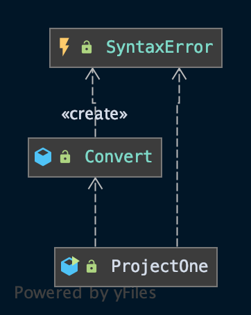

# CMSC 350 - Project 1

**Author:** Tyler D Clark  
**Date:** 25 March 2020  

**Description** A program that converts prefix expressions to postfix and postfix expressions to prefix. The program has three classes, including: ProjectOne.java, the main driver and the class in which the GUI object is created; Convert.java, the class that includes the methods for converting expressions as well as utility methods; and SyntaxError.java, a checked exception to be thrown by Convert.java methods and caught within ProjectOne.java
___

## UML chart

 

___

## Test cases

|Test Case |Input|Expected Output|Actual Output|Pass?|Notes
|---|---|---|---|---|---|
|1|* 2 + 2 - + 12 9 2|2 2 12 9 + 2 - + * |2 2 12 9 + 2 - + * |Yes|Testing prefix to postfix with example expression from instructions.
|2|2 2 12 9 + 2 - + * |* 2 + 2 - + 12 9 2|* 2 + 2 - + 12 9 2|Yes|Testing postfix to prefix with the output of the previous example.
|3|+ + A * B C D|A B C * + D + |A B C * + D + |Yes|Testing prefix with characters
|4|1 2 3 4 5 6+-/*^|^ 1 * 2 / 3 - 4 + 5 6|^ 1 * 2 / 3 - 4 + 5 6| Yes|Testing all operators with no spaces between them.
|5|1 + 1|error|JOptionPane warning against invalid syntax|Yes|Testing infixes(bad input). Without proper error-handling, this would try to call pop on an empty stack
|6|(nothing)|error|JOptionPane asking for input|Yes|Without throwing an exception, simply pressing any of the buttons without input would add an empty string to the stack and eventually cause an EmptyStack exception
|7|+ 2 * 2 2 2|2 2 2 * +|JOptionPane warning that operand stack is not empty|Yes|Case with result being a non-empty stack

___

## Lessons learned

First and foremost, I learned of prefix and postfix expressions, which admittedly took a minute to wrap my head around. Once I got a grasp on them, they made much more sense to use. Since they removed the need for operator precedence, associativity and even parenthesis, it seems like a much more straightforward input for computing. Next, I gained insight on an useful implementation of a stack. Previously, I knew of stacks, but not of many specific tasks that were primed for stacks use. Lastly, through working through the project, I got to work with the StreamTokenizer class. I found the interface to be slightly different at first, but once I dug onto the documentation, it was easy to learn. I weighed the pros and cons of StringTokenizer vs StreamTokenizer and in the end I liked the StreamTokenizer implementation better. I imagine I will use it many times in the future.
