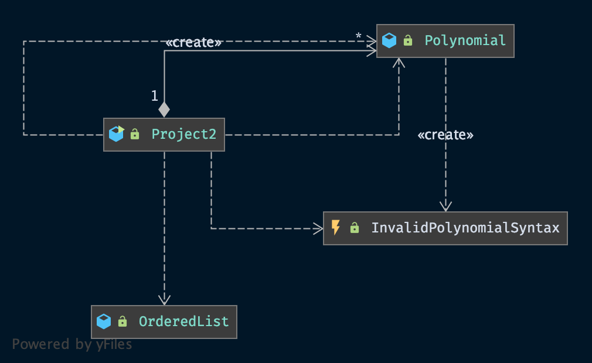
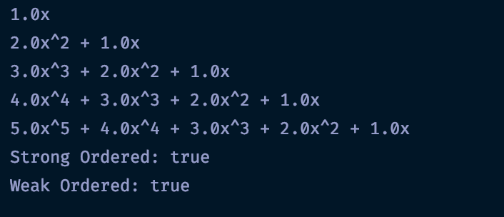
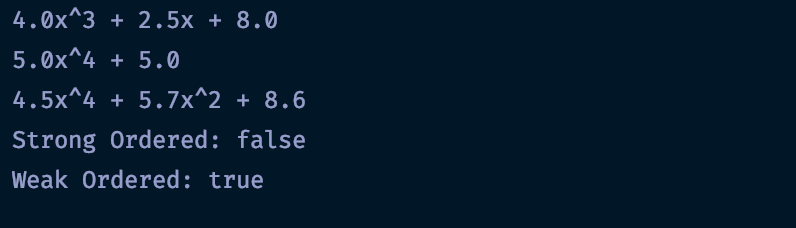
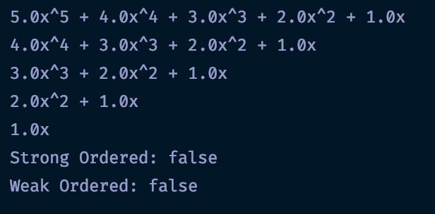
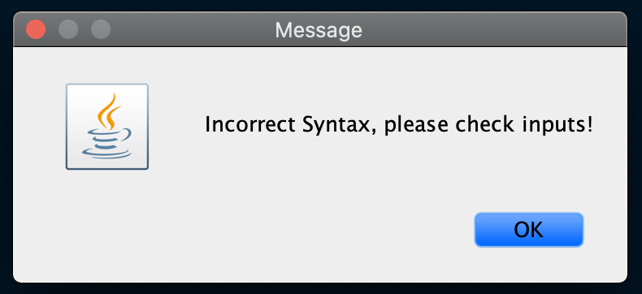
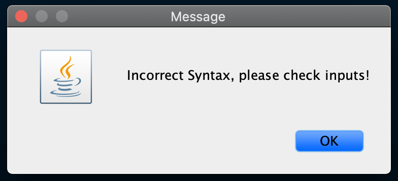

# CMSC 350 - Project 2

**Author:** Tyler D Clark  
**Date:** 11 April 2020

**Description** A program that reads space separated values (double for coefficient and int for exponent) from a text file and creates Polynomial object from them. The Polynomial objects are represented by a singly linked list of term objects. The term objects hold the coefficient and exponent values. As the file is being read, the objects are displayed and then determined if sorted weak or strong.
___

## UML chart

 

___

## Test cases

|Test Case |Input|Expected Output|Actual Output|Pass?|Notes
|---|---|---|---|---|---|
|1|1.0 1 2.0 2 1.0 1, 3.0 3 2.0 2 1.0 1, 4.0 4 3.0 3 2.0 2 1.0 1, 5.0 5 4.0 4 3.0 3 2.0 2 1.0 1  |Strong Ordered: true Weak Ordered: true|Please see screenshot below |Yes|Testing a file in both strong and weak sorted order.

 

|Test Case |Input|Expected Output|Actual Output|Pass?|Notes
|---|---|---|---|---|---|
|2|4.0 3 2.5 1 8.0 0, 5.0 4 5.0 0, 4.5 4 5.7 2 8.6 0|Strong Ordered: false Weak Ordered: true|Please see screenshot below |Yes|Testing a file that is in weak order but not strong order. Also includes zero exponents.|

 

|Test Case |Input|Expected Output|Actual Output|Pass?|Notes
|---|---|---|---|---|---|
|3|5.0 5 4.0 4 3.0 3 2.0 2 1.0 1, 4.0 4 3.0 3 2.0 2 1.0 1, 3.0 3 2.0 2 1.0 1, 2.0 2 1.0 1, 1.0 1 | Strong Ordered: false Weak Ordered: false|Please see screenshot below|Yes|Testing a file that is not strong nor weak ordered.

 

|Test Case |Input|Expected Output|Actual Output|Pass?|Notes
|---|---|---|---|---|---|
|4|3.0 3 2.0 2 1.0|error|JOptionPane warning against invalid syntax| Yes|Testing a file with a missing exponent. Exception is caught in main class.

 

|Test Case |Input|Expected Output|Actual Output|Pass?|Notes
|---|---|---|---|---|---|
|5|2.5 -5 2.0 -4 1.5 -3 1.0 -2 0.5 -1|error|JOptionPane warning against invalid syntax|Yes|Testing a file with a missing exponent. Exception is caught in main class.|

___

## Lessons learned

I learned much about the inter-workings of linked list while working on this program. Before, I would simply use the pre-defined linked list class without much thought to how it was implemented. However now, I have a newfound appreciation for it. In the future, I will likely just implement my own linked list if it is needed. I also learned a lot about the comparable interface. I found the overloaded implementation of the checkSorted method very interesting. Specifically how the one parameter method should call the second.