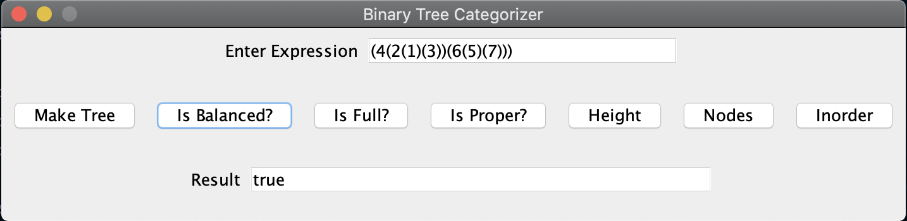
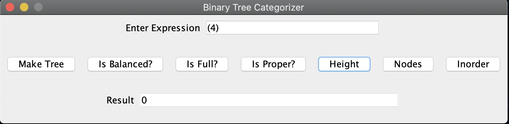

# CMSC 350 - Project 3

**Author:** Tyler D Clark  
**Date:** 26 April 2020

**Description** A program that allows the user to enter a binary tree in a parenthesized prefix format and then allows it to be categorized and allows various features of that tree to be displayed.
___

## UML chart

 

___

## Test cases

|Test Case |Input|Expected Output|Actual Output|Pass?|Notes
|---|---|---|---|---|---|
|1|(4(2(1)(3))(6(5)(7))); Make Tree|(4(2(1)(3))(6(5)(7)))|(4(2(1)(3))(6(5)(7))|Yes|Standard 3-level tree parenthesized correctly.|

fig1. Binary tree constructed

 

|Test Case |Input|Expected Output|Actual Output|Pass?|Notes
|---|---|---|---|---|---|
|2a|(Following previous input) Is Balanced?|true|true|Yes|Showing proper identification of a balanced tree.|
|2b|(4(2(1)(3))); Is Balanced?|false|false|Yes|Showing proper identification of a un-balanced tree.|

fig2. Balanced tree

fig3. Unbalanced tree

 

|Test Case |Input|Expected Output|Actual Output|Pass?|Notes
|---|---|---|---|---|---|
|3a|(4(2(1)(3))(6(5)(7))); Is Full?|true|true|Yes|Showing proper identification of a full tree.|
|3b|(4(2(1)(3))(6(5))); Is Full?|false|false|Yes|Showing proper identification of a non-full tree.|

fig4. Full tree

fig5. Non-full tree

 

|Test Case |Input|Expected Output|Actual Output|Pass?|Notes
|---|---|---|---|---|---|
|4a|(4(2(1)(3))(6(5)(7))); Is Proper?|true|true|Yes|Showing proper identification of a proper tree.|
|4b|(4(2(1)(3))(6(5))); Is Proper?|false|false|Yes|Showing proper identification of a non-proper tree.|

fig6. Proper tree

fig7. Non-proper tree

 

|Test Case |Input|Expected Output|Actual Output|Pass?|Notes
|---|---|---|---|---|---|
|5a|(4(2(1)(3))(6(5)(7))); Height|2|2|Yes|Showing height of the previous example.|
|5b|(4); Height|0|0|Yes|Showing height of one node.|

fig8. Two height tree

fig9. One node tree height

 

|Test Case |Input|Expected Output|Actual Output|Pass?|Notes
|---|---|---|---|---|---|
|6a|(4(2(1)(3))(6(5)(7))); Nodes|7|7|Yes|Showing node count of the previous example.|
|6b|(4); Nodes|1|1|Yes|Showing node count of one node tree.|

fig10. Seven node tree

fig11. One node tree

 

|Test Case |Input|Expected Output|Actual Output|Pass?|Notes
|---|---|---|---|---|---|
|7|(4(2(1)(3))(6(5)(7))); In Order|(((1)2(3))4((5)6(7)))|(((1)2(3))4((5)6(7)))|Yes|Showing In order printing of tree.|

fig12. In Order printed tree

 

|Test Case |Input|Expected Output|Actual Output|Pass?|Notes
|---|---|---|---|---|---|
|7a|(1; Make Tree|Error|JOptionPane|Yes|Showing JOptionPane warning against improper syntax|
|7b|(1)(; Make Tree|Error|JOptionPane|Yes|Showing JOptionPane warning against improper syntax|
|7c|(1(2)(3)(4)); Make Tree|Error|JOptionPane|Yes|Showing JOptionPane warning against too many children|
|7d|blank; Make Tree|Error|JOptionPane|Yes|Showing JOptionPane warning against no input|

fig13. Incorrect syntax

fig14. More incorrect syntax

fig15. Even more incorrect syntax

fig16. No input

 

|Test Case |Input|Expected Output|Actual Output|Pass?|Notes
|---|---|---|---|---|---|
|8a|(A(G(j)(1))(z(5))); Make Tree|(A(G(j)(1))(z(5)))|(A(G(j)(1))(z(5)))|Yes|Showing tree from instructions|
|8b|(previous example); In Order|(((j)G(1))A((5)z))|(((j)G(1))A((5)z))|Yes|Showing in order example from instructions|

fig17. Instruction example

fig18. Instruction example in order

 
 
___

## Lessons learned

I got a lot of reps in with recursion in this exercise. I definitely felt more comfortable with recursion through doing it. I also learned a lot about the nature of Binary Trees and feel much more comfortable implementing them. Even though I had difficulty creating nodes recursively in this exercise (due to the parentheses tripping me up), I definitely would look forward to implementing another in the future. I had a lot of fun figuring out how to get my code as concise as possible. I probably over-documented my code and used the conditional operator too much, but I had a good time doing it.
