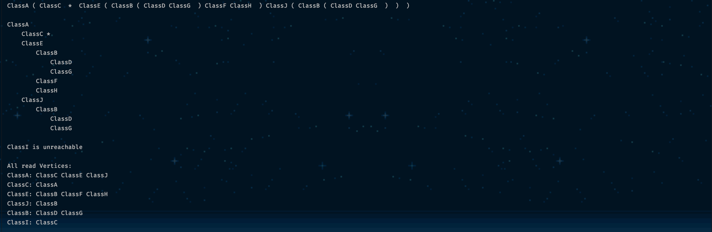

# CMSC 350 - Project 4

**Author:** Tyler D Clark  
**Date:** 10 May 2020

**Description:** A program that allows the user to select a file to be read. From that file, graphs are to be constructed
using the DirectedGraph class. The program prints two different displays for the graphs, which use the ParenthesizedList 
and Hierarchy classes. Those two classes both implement the DFSActions interface, which creates the method bodies for 
actions in key locations of the Depth First Search.
___

## UML chart

 

___

## Test cases

|Test Case |Input|Notes
|---|---|---|
|1|input.txt|Test case of a graph with circular dependencies. Also the example from the instructions.|

fig1. Output from processing input.txt

|Test Case |Input|Notes
|---|---|---|
|2|input2.txt|Test case of a graph with no circular dependencies.|

fig2. Output from processing input2.txt

|Test Case |Input|Notes
|---|---|---|
|3|input3.txt|Test case of a graph with unreachable classes.|

fig3. Output from processing input3.txt

|Test Case |Input|Notes
|---|---|---|
|4|input4.txt|Test case of a graph with no unreachable classes.|

fig4. Output from processing input4.txt
___

## Lessons learned

This project taught me a lot about the graph data structure, and the recursive implementation of the
depth first search. Once again, I had the opportunity to get practice with custom data structures like the
linked lists in this exercise, which were implemented with edges and vertices. If I was to do this again, I would 
likely make the nested static classes also implement Iterator so that I would have less verbose iteration. 
As I implemented DFSActions for Hierarchy and ParenthesizedList, I definitely felt more comfortable with the algorithm
for DFS. At first when preparing for this project, I wanted to use a stack to traverse the graph, but now I see that
recursion is a better (and now more comfortable) choice.
